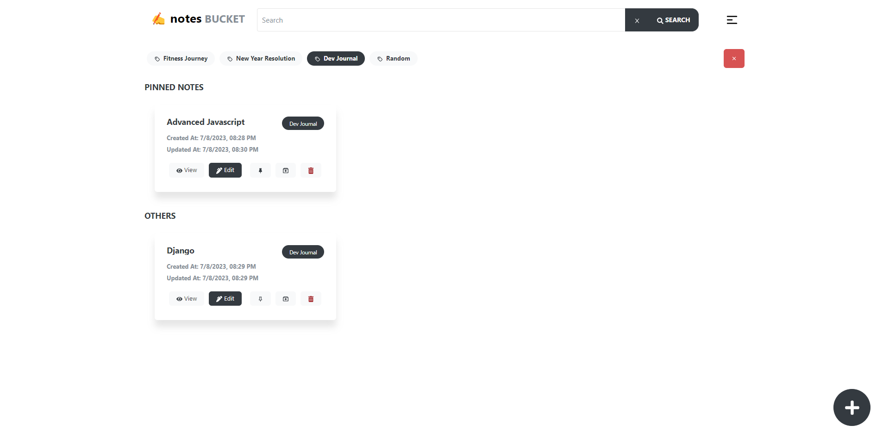
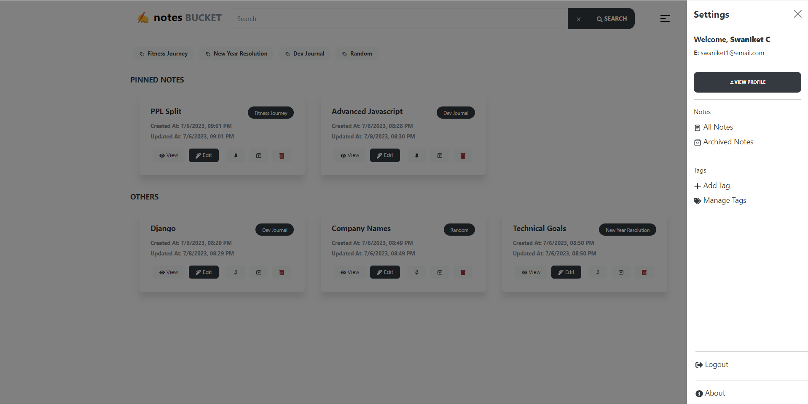

# Notes Bucket

Notes bucket is a feature rich notes application, where user can create, edit, view and delete notes.

### Features

- Full authentication system (login and signup).
- Emogi and Markdown support for notes.
- Organization of notes by tags.
- Ability to pin and archive notes.
- Search Notes & Filter notes by tags
- User Profile page for some quick KPI and ability to update user profile.

### Screens

1. Login

2. Signup

3. Home Page

4. Home Page - Filter by Tag

5. Home Page - Search

6. Create New Note

7. Create Note - Immersive Mode

8. Edit Note

9. View Note

10. Delete a note

6. Quick Settings menu

7. Manage Tags Page

8. Manage Tags Page - Search

9. Manage Tags Page - Add a tag

10. Manage Tags Page - Remove a tag

11. Profile Page

### Tech Stack

- ReactJS + Vite
- Redux-Toolkit
- Axios
- Bootstrap
- Node + ExpressJS
- MySQL

### How to run on the local machine

You need to have the following installed in your system to run the project

1. NodeJS
2. MySQL

After installing these -

1. Go to the `dbScripts` folder and run the `createTables.sql` file to create the tables locally.
2. Go to the `api` folder and run `npm install`.
3. After the installation is done, run `npm run dev` to run the express server locally.
4. Go to the `ui` folder and run `npm install`.
5. After the installation is done, run `npm run dev` to run the vite server locally.

### Roadmap

- ~~Add notes encryption in the database~~.
- Add the forgot password module.
- Edit Password module.
- First Login Instructions - Add a tag to get started.
- Animations.
